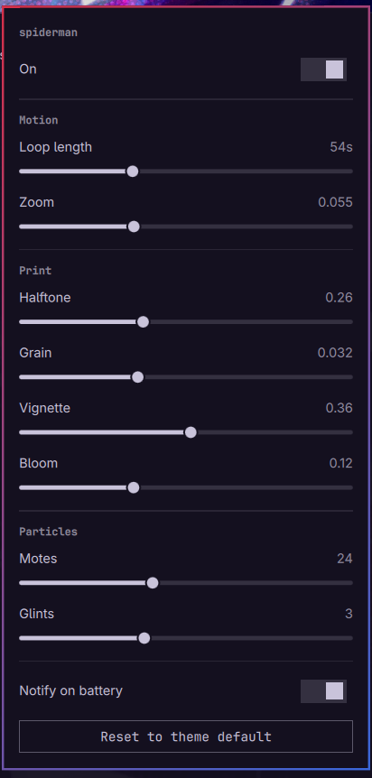

# Live Wallpaper

A drop-in replacement for Omarchy's `omarchy.background` service that adds a
**per-theme live treatment** to the desktop.

The lock screen picks up the same treatment behind its blur if you also install
the companion `io.github.sumdahl.lock` plugin. That part is optional — without
it the desktop treatment works exactly the same and the lock screen stays
stock.

**Every theme is live by default.** Install the plugin and all of them animate,
each in its own palette — a theme has to ship nothing at all. Themes that want
a specific look declare it; users who want something else override it; anyone
who wants a static wallpaper opts out.

## Install

```bash
omarchy plugin add https://github.com/sumdahl/omarchy-plugin-livewallpaper.git --enable
```

That is the whole thing. The plugin finishes its own setup the first time it
mounts: it puts `omarchy-live` on your `PATH` and merges the
`Style > Live Wallpaper` rows into
`~/.config/omarchy/extensions/omarchy-menu.jsonc`, then tells you once that it
did. Both steps are necessary because `omarchy plugin add` does not run a
plugin's `install.sh`, and Omarchy's menu reads exactly one user file — a plugin
cannot contribute rows to it from its own directory. Skipping them is what made
this plugin look broken on a machine other than the one it was written on.

The merge is textual and additive: it creates the file if missing, never touches
keys it does not own, preserves the comments in a JSONC file, and is a no-op on a
second run. `omarchy-live menu-uninstall` removes only its own rows. The setup
also refreshes `~/.local/bin/omarchy-live` whenever it differs from the plugin's
copy, so `omarchy plugin update` cannot leave a stale command talking to a newer
service.

Cloning by hand instead? `./install.sh` does the same work up front, and
`omarchy restart shell` mounts it.

Nothing about the menu is required — the bar icon works on its own.

## Removal

```bash
omarchy-live menu-uninstall       # takes back only its own menu rows
omarchy plugin disable io.github.sumdahl.livewallpaper
rm -rf ~/.config/omarchy/plugins/io.github.sumdahl.livewallpaper
rm -f  ~/.local/bin/omarchy-live
rm -rf ~/.config/omarchy/live ~/.config/omarchy/live.json   # your overrides
omarchy restart shell
```

Disabling restores Omarchy's built-in `omarchy.background`, so the desktop goes
back to a stock static wallpaper. Themes keep their `live/live.json` — it is
inert without this plugin and costs nothing to leave in place. Remove the bar
icon with `omarchy bar remove io.github.sumdahl.livewallpaper` if it lingers.

## Bar widget



An icon on the bar, active while the treatment is actually rendering:

- **click** — panel with the controls below
- **middle click** — pause or resume, no panel
- **tooltip** — current theme and whether the scene is running, parked behind a
  fullscreen window, or reduced on battery

The panel adjusts loop length, zoom, halftone, grain, vignette, bloom, motes and
glints; toggles the treatment and the battery notice; and resets to the theme
default by dropping your override. Sliders commit on release, so a drag is one
write rather than sixty. Values are read from the resolved spec the service
publishes, so the panel follows changes made from the menu, from a terminal, or
by switching theme.

## Spec layers

Four sources, merged **shallow per section** — a layer naming `motion` owns that
whole section, and sections it omits fall through. Later wins:

| # | Source | Purpose |
|---|--------|---------|
| 1 | built-in defaults | Baseline: parallax and motes, no halftone, colours `auto` |
| 2 | `~/.config/omarchy/live.json` | Your preference for every theme |
| 3 | `<theme>/live/live.json` | What the theme's author intended |
| 4 | `~/.config/omarchy/live/<theme>.json` | Your override for one theme |

`"auto"` colours resolve against the live palette, so ink always matches the
desktop. Halftone is **off** in the baseline on purpose: the ben-day comic pass
is a Spider-Verse conceit and looks wrong on a photographic or minimal theme, so
only a theme that asks for it gets it.

A malformed layer is warned about and skipped — the layer below shows instead of
a black wallpaper.

**Opting out:** `"enabled": false` at the top level of any layer. In layer 2 it
disables the plugin everywhere, in layer 3 a theme author declares "this theme
should not animate", and in layer 4 you overrule either:

```bash
omarchy-live toggle           # persistent, this theme — what the menu row runs
omarchy-live disable nord     # persistent, naming a theme
omarchy-live off              # this session only, every theme
```

`toggle` and `on`/`off` are deliberately different switches. The menu tick is a
setting, so it writes the persistent one and survives a reboot; `on`/`off` are
the transient escape hatch. `omarchy-live is-on` reports the two combined — the
same value the renderer gates on — so the tick and the screen cannot disagree.

## Where edits land

`tune`, `preset` and `edit` always write to layer 4,
`~/.config/omarchy/live/<theme>.json` — never into the theme itself. So tuning
works identically on a stock theme under `/usr/share/omarchy/`, on a theme
cloned from git, and on one you wrote yourself, and none of them are modified
by it. `omarchy-live path` prints the file that would be used.

That also makes **reset** meaningful: `omarchy-live reset` drops your override
and the theme's own look returns.

Editing a theme's own spec is an authoring act, and needs saying so:

```bash
omarchy-live edit theme      # opens <theme>/live/live.json itself
```

An earlier version guessed at this — it wrote into a theme's own spec whenever
one existed and was writable. That quietly dirtied git checkouts on every slider
drag, and left `reset` with nothing to reset to, since the "default" was the
file being edited.

`omarchy-live install <theme>` materialises an editable spec inside a theme
directory. For a stock theme it creates an **overlay** — a user theme directory
holding nothing but `live/`. `omarchy-theme-set` copies the stock theme into
staging first and lays the user one over the top, so the overlay adds a spec
without forking wallpapers or colours.

## What it renders

Composited in this order, then put through one shader pass so the whole frame
reads as a single printed cel rather than layered sprites:

| Layer | What it does |
|-------|--------------|
| **Parallax** | Slow zoom and elliptical drift over the wallpaper. Every term is an integer harmonic of one `0..2π` phase, so the loop closes with matching position *and* velocity — no seam at the wrap. |
| **Web glints** | Thin angled light streaks sweeping across, at randomised intervals. Reads as light travelling along a strand. |
| **Motes** | GPU particles drifting down — dust, snow, city light. |
| **Comic print** | Fragment shader: rotated ben-day dot screens in the theme's two ink colours, chromatic aberration on the spider-sense pulse, an accent rim, highlight bloom, animated grain, vignette. |

The dot screens are weighted to the **midtones**, not to everything dark, so a
large flat night sky stays clean instead of turning into a screen door.

## Power behaviour

The scene parks itself — animations stopped, shader layer and its offscreen
buffer dropped entirely — when:

- a **fullscreen window** covers the wallpaper (resumes within ~1s of leaving it)
- the **screen is locked** — detected from whichever lock plugin is mounted,
  so this works on its own; the companion plugin also pushes the signal over
  IPC when installed
- the treatment is switched off

Measured cost of the full treatment on Intel Iris Xe at 1920x1080:
**+3.6 percentage points of one core** over the stock static background.

**On battery the scene parks itself, and comes back on its own when you plug in.**
`power.onBattery` chooses what unplugging does:

| value | on battery |
|---|---|
| `"off"` *(default)* | scene parks completely |
| `"low"` | drops to parallax only — no glints, motes or shader pass |
| `"ignore"` | full effect, as if plugged in |

This is a *derived* state, not a switch that gets flipped: nothing is stored, so
reconnecting the mains restores exactly what you had with no click and nothing to
get stuck in. `power.batterySaver: true` from an older spec is still read as
`"low"`, and `false` as `"ignore"`.

Battery state comes from UPower, the same source stock Omarchy uses. An earlier
version read `/sys/class/power_supply/AC/online` directly, which was wrong on any
laptop that calls that node `ADP1`, `ACAD` or `AC0` — and wrong even where the
path was right, because sysfs does not deliver the change notifications the
watcher was waiting on.

On unplugging, a notification says the scene paused itself and will resume on AC
— once per discharge, re-armed when the mains return, never at startup, and never
when the treatment was already off or `power.onBattery` is `"ignore"`. Silence it
with `power.notifyOnBattery: false` in any layer.

## Control

```bash
omarchy-live status              # current state as JSON, including which layers apply
omarchy-live toggle              # on/off, persistent — what the menu row runs
omarchy-live off | on            # this session only, every theme
omarchy-live disable <theme>     # persistent, one theme
omarchy-live speed 1.5           # motion multiplier, 0.1-8 (1.0 = built-in pace)
omarchy-live tune print.halftone 0.4
omarchy-live preset bold         # subtle | balanced | bold
omarchy-live reset               # drop your override for this theme
omarchy-live path                # print the file an edit would go to
omarchy-live edit                # open that file
```

When an edit lands in a theme's own spec it is mirrored into the staged copy
under `~/.local/state/` too — writing only there would look right until the next
`omarchy theme set` rebuilt the directory and silently discarded the change.

## live.json

Every key is optional; the values below are the built-in defaults.

```jsonc
{
  "enabled": true,                                      // false opts this layer out
  "motion": { "period": 36, "speed": 1.0, "zoom": 0.05, "driftX": 0.014, "driftY": 0.009 },
  "print":  { "halftone": 0.0, "dotScale": 150, "grain": 0.022,
              "vignette": 0.30, "bloom": 0.08 },
  "pulse":  { "everyMin": 24, "everyMax": 55, "attack": 200, "hold": 90,
              "release": 800, "aberration": 0.004 },
  "glints": { "count": 2, "everyMin": 12, "everyMax": 30, "length": 0.45,
              "thickness": 1.6, "speed": 1100 },
  "motes":  { "rate": 14, "life": 14000, "size": 2.6, "drift": 16, "fall": 18 },
  "colors": { "accent": "auto", "secondary": "auto" },  // "auto" = theme palette
  "lock":   { "pulse": 0.5 },                           // 0 disables the lock rim
  "power":  { "onBattery": "off", "notifyOnBattery": true },
  "video":  null                                        // path, relative to live/
}
```

`period` is in seconds; every other duration is in milliseconds. `speed`
multiplies the loop rather than restating it — the effective loop is
`period / speed` — so a preference for livelier motion survives a theme that
sets its own period.

Every numeric here is clamped to a sane range on the way in (`SpecBounds.js`),
and the mote population is bounded as a whole rather than per key, so no spec
file can turn the wallpaper into a denial of service.

### Video wallpapers

Set `video` to a file next to `live.json` and it plays looped through
QtMultimedia instead of the parallax still, with the shader pass still applied
on top. If the file is missing or the codec is unavailable the still image shows
instead — the plate underneath is already loaded and correct for the theme.

The parallax path is usually the better choice: it stays crisp at any
resolution because it samples the 4K source directly, loops with no seam, and
costs far less than continuous video decode.

## How it replaces the built-in

`manifest.json` declares `omarchy.clonedFrom: "omarchy.background"`, so enabling
this plugin moves the built-in into `disabledPlugins[]` and exactly one
background renderer is ever mounted.

The stock contract is preserved verbatim: the `background` IPC target that
`omarchy-theme-bg-set` and `omarchy-theme-set` call into, the masked wipe
between wallpapers, and the double-click selectors. The live scene fades out for
the duration of a wipe so theme switching still gets the stock reveal instead of
a crossfade between two animating scenes.

Live controls sit on a separate `livewallpaper` IPC target so that contract is
never touched.

## Hardening

Not a behaviour change, added after the marketplace security baseline flagged
it. Worth carrying forward on a rebase rather than dropping as noise.

**Nothing is read without a ceiling.** Every file this plugin reads is writable
local state: a theme's `live.json`, the global and per-theme overrides, the
resolved spec in the runtime directory, the current theme name, the AC sysfs
node. `FileView` reads whatever it is pointed at, in full, into a process that
lives for the whole session, and it has no size limit of its own — so a file
that has grown to hundreds of megabytes at one of those paths took the shell's
memory with it, whether it got that way through corruption or on purpose.

`GuardedFile.qml` splits the job. `FileView` keeps the half it is safe at,
watching: `preload: false` stops it reading the file at all while
`watchChanges` still delivers the notifications live edits depend on. The
content comes from `head -c`, which stops at the ceiling inside the read itself
rather than measuring the file and then trusting the measurement — nothing above
the ceiling is ever allocated, and there is no window between the check and the
read for the file to grow in. A file over the ceiling is named in the log and
then treated exactly as a missing one, so the layer falls through, which is the
same degradation a malformed file already gets.

The ceiling is 256 KiB for the spec layers, 4 KiB for the theme name and the AC
node. The write-only `FileView` that publishes the resolved spec carries
`preload: false` too — it never reads that file, but without it a file already
sitting at that path would be pulled in for no reason at all.

Subprocess output is bounded the same way. The bar's `omarchy-shell
livewallpaper status` call and the `readlink` that resolves the current
background both pipe through `head -c` before `StdioCollector` sees them.

**Nothing is read without a deadline either.** A read that never finishes is as
bad as one that never stops growing: it holds the single reader, so every later
reload queues behind it and that file stops updating for the rest of the
session. A FIFO is the easy way to arrange that — opening one with no writer on
the other end blocks forever.

So the read tests for a regular file before it opens anything. `[ -f ]` answers
from a stat rather than an open, so a FIFO, a character device or a directory at
one of these paths is rejected without ever being opened. `timeout` covers what
the test cannot: a path that turns into a FIFO in the moment between the test
and the read, and a regular file that is simply slow to serve — one on a network
mount that has gone away. It runs the read in its own process group and signals
the group, so nothing is left behind. Either failure lands as absence, the same
as a missing file. The two `StdioCollector` calls carry the same deadline.

**Spec values are clamped, not just the bytes that carry them.** A ceiling on
how much of a file is read says nothing about what those bytes ask for.
`glints.count` becomes a `Repeater.model`, `motes.rate` an emitter's particles
per second, `motes.life` how long each is retained, and the pulse and glint
values become animation durations and timer intervals. A file well under a
kilobyte can therefore ask for a million scene items, and the cost lands in a
compositor-adjacent process that stays up for the whole session.

`SpecBounds.js` carries a range for every numeric the spec can set, applied both
at the merge — so the `status` output, the bar sliders and the published
resolved spec all see the same bounded values — and again in the renderer's
`cfg()`, which is the point every one of those values passes through and works
for a spec that arrived from somewhere other than this plugin's own merge. The
ranges sit far wider than anything a real theme wants: they are the point past
which a value stops being a look and starts being a denial of service.
Out-of-range clamps to the nearest end rather than dropping the layer, so a typo
still renders close to what was asked for; a non-number is not a value at all
and falls back to the consumer's own default.

One bound is not a single key. The standing mote population is emission rate
times lifetime, so a spec can put both of those inside their own ranges and
still ask for tens of thousands of live particles — Qt caps an `ImageParticle`
at 16383 and warns about it every frame past that. Emission is throttled against
a population budget, which the built-in baseline sits at roughly 7% of.

## Rebuilding the shader

`shaders/livefx.frag.qsb` is committed. After editing the `.frag`:

```bash
/usr/lib/qt6/bin/qsb --glsl "100 es,120,150" --hlsl 50 --msl 12 \
  -o shaders/livefx.frag.qsb shaders/livefx.frag
omarchy restart shell
```

Service plugins are remounted on shell restart, not by `rescanPlugins` — editing
one and only rescanning leaves the old code running.
